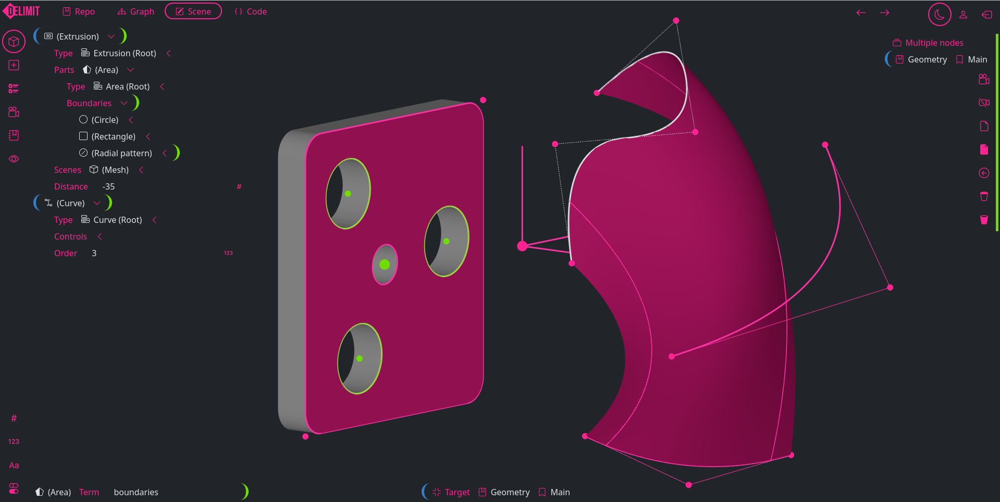

  

# Delimit
Delimit is a CAD/CAM platform designed to help artists think like engineers and engineers think like artists. This is the early stage of development and the product is not usable. This repo contains the web app for interacting with graphs and 3D models. See delimit_axiom for the Rust WebAssembly (WASM) module. 

## Concepts
Drawings and mechanical designs are stored as directed graphs in repositories (repos). Repos will have git-like version control with "commit" being the only currently available git-like command. 
The core app runs in parallel with the sandboxed graph app. The graph app runs user code to return "models" and 3D scenes to the core app. Models are JSON objects that describe topics such as curves, surfaces, solids. The user code calls the Axiom WebAssembly module to get data like points, polylines, and meshes for return to the core app.
Any number of repos can be loaded at the same time and they may depend on each other. The visual graph will populate and show connections between repos as they are loaded. Think of the graph as the source of truth or alternative for the tree view in other CAD applications. 